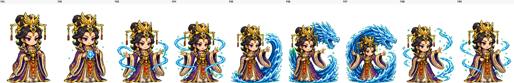
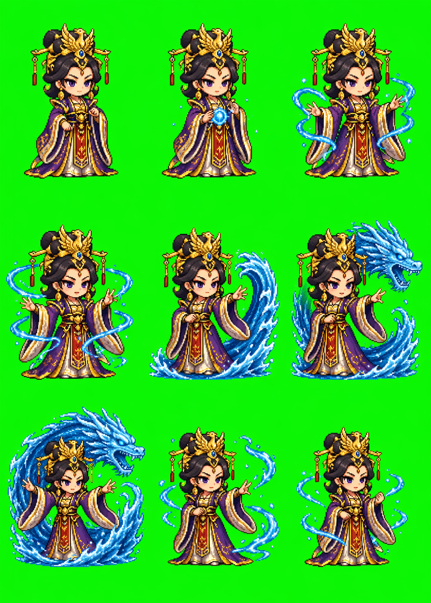

# Playwright OpenAI Plugin

Installable Codex plugin plus local Playwright CLIs for operating already logged-in browser sessions:

- `poai` controls ChatGPT/OpenAI browser workflows.
- `csdn-publish` prepares CSDN Markdown drafts, uploads local body images, sets the cover, and fills publish settings.
- `x-articles-publish` validates Markdown, inspects a logged-in X Article composer, fills a visible draft, and requires exact-title confirmation before final publication.
- `xhs-publish` validates Xiaohongshu note Markdown/media, inspects a logged-in Creator publish page, fills a visible draft, and requires exact-title confirmation before final publication.

This repository is designed to be cloned directly into a Codex plugin directory.

## What It Looks Like

`poai` can drive ChatGPT image generation, collect the result, then package game sprites into transparent frames, an atlas, a GIF preview, QA report, and zip.

### Example: Wu Zetian Water Jutsu Sprite Action

Animated GIF preview generated by the action-pack workflow:


Contact sheet for quick frame review:



Raw 3x3 source sheet before frame extraction:



Prompt used for the browser-backed image generation:

```text
Create a game-ready 3x3 sprite sheet on a solid high-contrast removable background.

Character: chibi Wu Zetian, Tang dynasty empress, phoenix crown, black-and-gold robe,
recognizable royal silhouette, consistent face and outfit in every frame.

Action: water-jutsu spell cast. The animation should read left to right, top to bottom:
1 idle preparation, 2 hands gather water, 3 water ring appears, 4 wave rises,
5 wave curls around her, 6 water dragon shape forms, 7 spell release,
8 splash follow-through, 9 return to balanced stance.

Sprite requirements: one full-body character per cell, fixed camera, fixed scale,
bottom-center foot anchor, no cropped head or feet, no overlapping cell borders,
crisp game-art edges, transparent-friendly subject separation.
```

Equivalent command shape:

```bash
scripts/poai action-pack create \
  --character "chibi Wu Zetian, Tang dynasty empress, phoenix crown, black-and-gold robe, casting a water-jutsu spell" \
  --actions water-jutsu \
  --grid 3x3 \
  --frames-per-action 9 \
  --frame-size 160x224 \
  --model thinking \
  --output-dir ./outputs/wuzetian-water-jutsu
```

The resulting package passed structural QA with 9 frames, 0 errors, and 0 warnings.

### More Prompt Starting Points

Single image generation:

```text
A clean app icon for a browser automation tool, rounded square, emerald accent,
minimal Chrome window outline, subtle Playwright cue, flat vector-like rendering,
high contrast on a transparent-friendly background.
```

Game action-pack generation:

```text
Create a 4x4 sprite sheet for a small fantasy mage casting lightning.
Keep one character per cell, fixed scale, fixed camera, bottom-center foot anchor,
clear frame-by-frame motion, removable high-contrast background, no cropped body parts.
```

Prompt-router discovery:

```bash
python3 skills/gpt-image-prompt-router/scripts/prompt_router.py route \
  "Q版历史人物 游戏技能 水遁 连续帧 spritesheet" \
  --language zh \
  --limit 5
```

## Install

```bash
git clone <repo-url> ~/.codex/plugins/playwright-openai-plugin
cd ~/.codex/plugins/playwright-openai-plugin
npm install
```

Or install from an existing local checkout:

```bash
./scripts/install-local.sh
```

## Verify

```bash
scripts/poai --help
scripts/csdn-publish.mjs --help
scripts/x-articles-publish.mjs --help
scripts/xhs-publish.mjs --help
npm run check
```

## Browser Setup

Start a managed Chrome profile with CDP enabled:

```bash
scripts/poai browser launch --text
scripts/poai discover --json
```

Log in to ChatGPT in the launched browser if discovery reports a login-required state.

For CSDN publishing, launch the editor and log in once:

```bash
npm run csdn:launch
npm run csdn:inspect -- --endpoint http://127.0.0.1:9333
```

For X Articles or Xiaohongshu publishing, launch the corresponding editor and log in once:

```bash
npm run x:launch
npm run x:articles:inspect -- --endpoint http://127.0.0.1:9333

npm run xhs:launch
npm run xhs:inspect -- --endpoint http://127.0.0.1:9333
```

## Common Commands

```bash
scripts/poai status --json
scripts/poai discover --json

scripts/poai image submit --prompt "A clean icon of a green square" --model auto --json
scripts/poai image wait --job-id <job-id> --json
scripts/poai image collect --job-id <job-id> --json

scripts/poai image inspect --job-id <job-id> --json
scripts/poai image revise --job-id <job-id> --prompt "Make it simpler" --json
```

For image work, `--model auto` routes by generation difficulty. Simple requests use Instant; complex requests involving reference images, typography, layout, product detail, character consistency, sprites/action grids, or multi-panel structure use Thinking. For explicit quality-over-speed requests, use `--model thinking`, `--model extended`, or `--model heavy`.

Pro is not the normal image-generation route because ChatGPT Pro currently does not expose image generation. A `--model pro` image request is treated as Pro-quality intent and routed to Thinking/Heavy rather than selecting Pro.

## CSDN Publish Workflow

Validate inputs without touching the browser:

```bash
scripts/csdn-publish.mjs --dry-run \
  --title "文章标题" \
  --markdown-file ./article.md \
  --cover ./cover.png \
  --image hero=./hero.png
```

Prepare a draft and stop before final publication:

```bash
scripts/csdn-publish.mjs --draft \
  --endpoint http://127.0.0.1:9333 \
  --title "文章标题" \
  --markdown-file ./article.md \
  --strip-title-heading \
  --cover ./cover.png \
  --image hero=./hero.png \
  --summary "文章摘要，最多 256 字" \
  --tags Playwright,CSDN,自动化 \
  --category AI编程 \
  --article-type original \
  --visibility public
```

Use `{{csdn:image:key}}` in Markdown for local body images and pass `--image key=./image.png`. The script imports final Markdown through CSDN's Markdown import flow so headings, lists, code blocks, and uploaded image URLs survive editor conversion. Requested cover, summary, tags, category, article type, source URL, and visibility are read back from the publish dialog; missing confirmations return `ok: false`. Real publication requires `--publish --confirm-publish "<exact title>"`.

For reposted or translated articles, add `--source-url https://example.com/original-article`.

## X Articles Publish Workflow

Validate Markdown before touching the browser:

```bash
scripts/x-articles-publish.mjs --dry-run \
  --title "Article title" \
  --markdown-file ./article.md \
  --strip-title-heading
```

Prepare a visible draft and stop before final publication:

```bash
scripts/x-articles-publish.mjs --draft \
  --endpoint http://127.0.0.1:9333 \
  --title "Article title" \
  --markdown-file ./article.md \
  --strip-title-heading \
  --validate-preview
```

X Articles automation uses the x.com web editor. The script supports a stable Markdown subset plus standalone local images, native dividers, fenced code, LaTeX blocks, status-URL X post embeds, GIF inserts, and preview validation. Remote Markdown images are blocked; download them locally first or place media manually during visible review. Real publication requires `--publish --confirm-publish "<exact title>"`.

## Xiaohongshu Publish Workflow

Validate note text and local media before touching the browser:

```bash
scripts/xhs-publish.mjs --dry-run \
  --title "笔记标题" \
  --markdown-file ./note.md \
  --image ./cover.png \
  --strip-title-heading
```

Prepare a visible draft and stop before final publication:

```bash
scripts/xhs-publish.mjs --draft \
  --endpoint http://127.0.0.1:9333 \
  --title "笔记标题" \
  --markdown-file ./note.md \
  --strip-title-heading \
  --image ./cover.png \
  --image ./detail.png \
  --topic AI工具 \
  --visibility public
```

Xiaohongshu automation uses the Creator web editor. The script converts a conservative Markdown subset into note text, uploads local media through file inputs, appends topics, and can set original declaration, content type, visibility, duet/copy permissions, scheduled publish time, best-effort location, and opt-in draft saving. Markdown image syntax is not mapped into the editor; pass display-order media with repeated `--image` flags. Real publication requires `--publish --confirm-publish "<exact title>"`.

## GPT Image Prompt Router Skill

The plugin also includes `skills/gpt-image-prompt-router/SKILL.md`, a Codex skill for routing image ideas to prompt patterns from the bundled `awesome-gpt-image-2` catalogue snapshot.

```bash
python3 skills/gpt-image-prompt-router/scripts/prompt_router.py route "电商主图 直播间 科技产品" --language zh --limit 5
python3 skills/gpt-image-prompt-router/scripts/prompt_router.py show 13460 --language zh
```

The catalogue is adapted from [YouMind-OpenLab/awesome-gpt-image-2](https://github.com/YouMind-OpenLab/awesome-gpt-image-2) under CC BY 4.0, with source details in `skills/gpt-image-prompt-router/references/SOURCE.md`.

## Action Pack Workflow

Generate or package animation action sheets into transparent frame PNGs, an atlas, GIF preview, QA report, manifest, and zip:

```bash
scripts/poai action-pack create \
  --character "consistent game pet character" \
  --actions idle,walk,run,jump,attack,cast,hurt,victory \
  --output-dir ./outputs/my-action-pack
```

Strict QA runs by default and writes `package/qa_report.json`. If QA finds severe structural issues, the command returns `completed=false` and recommends regeneration or reprocessing. Use `--qa warn` only when you want to keep a suspect package for inspection.

For game-ready continuous-frame sprites, the action-pack flow treats the raw sheet as a source image rather than trusting naive cell crops:

- generate with a pixel-grid-aware prompt/reference so poses stay close to fixed cells;
- recover foreground pose components across the whole sheet before splitting, which protects feet, hats, and effects that slightly cross cell boundaries;
- remove the removable background per recovered frame;
- normalize each frame onto a shared bottom-center anchor so the character does not drift or bob during playback;
- write `package/contact_sheet.png` for quick frame review and manual curation.

Use `--frame-order` when the raw sequence needs hand curation or rhythm fixes:

```bash
scripts/poai action-pack create \
  --from-dir ./outputs/raw-sheets \
  --actions attack \
  --grid 2x5 \
  --frames-per-action 10 \
  --frame-order F01,F03,F02,F04,F05,F07,F09 \
  --frame-size 256x256 \
  --output-dir ./outputs/attack-curated
```

For browser-backed generation, add `--regen-failed --regen-attempts 1` to retry only actions that fail strict QA. This is intentionally opt-in because it consumes generation quota.

Package existing sheets without touching the browser:

```bash
scripts/poai action-pack create \
  --from-dir ./outputs/raw-sheets \
  --actions idle,walk \
  --output-dir ./outputs/action-pack-smoke
```

## Safety

- This plugin does not include browser cookies, local storage, auth headers, job metadata, or generated outputs.
- Managed browser profile and local jobs live outside this repo under `~/.playwright-openai/`.
- ChatGPT conversation URLs are redacted in command output.
- Image jobs are designed as submit/wait/collect/revise workflows to avoid duplicate submissions.
- Action-pack manifests avoid prompt text, character descriptions, source URLs, and browser session material.
- Action-pack QA reports store structural frame metrics only.
- Selective regeneration retries only QA-failed generated actions and is bounded by `--regen-attempts`.
- CSDN automation defaults to dry-run or draft-safe operation; real publication requires `--publish --confirm-publish "<exact title>"`.

## Included Codex Skill

The plugin includes:

- `skills/playwright-openai/SKILL.md`, which teaches Codex how to use the CLI safely.
- `skills/gpt-image-prompt-router/SKILL.md`, which helps Codex find and adapt GPT Image 2 prompt examples before generation.
- `skills/csdn-publish/SKILL.md`, which teaches Codex how to prepare CSDN drafts with body images, cover, summary, tags, category, article type, source URL, and visibility.
